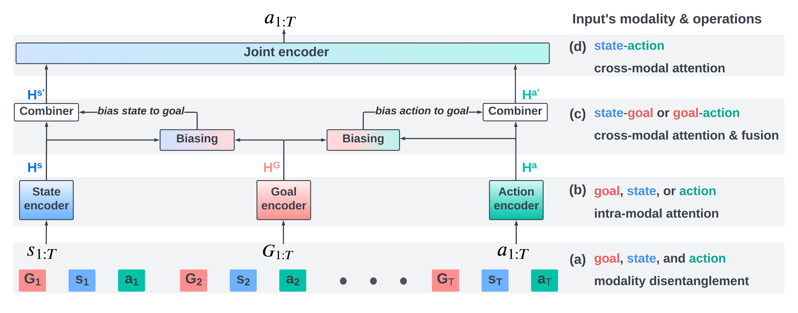

# Official-codebase-for-Decision-Transducer
This is the pytorch implementation of the UAI2023 paper  "A Trajectory is Worth Three Sentences: Multimodal Transformer for Offline Reinforcement Learning" [PMLR link](https://proceedings.mlr.press/v216/wang23d.html). A 2:30 [presentation](https://youtu.be/-f3zd_2GWuE).

## Overview
This repo contains full implementation of a multimodal transformer: Decision Transducer. It was designed to improve transformers performance on offline RL, by disentangling the complicated interactions between modalities (state, action, return/goal).



## Descriptions

### Gym locomotion code ([gym-transducer](./gym-transducer)): 
* Train a Decision Transducer (DTd) model with: 
    * Goal $G_t$ as return: experiment_transducer.py 
    * Goal $G_t$ as state-value from IQL: experiment_transducer_goal.py 
* Train a Decision Transformer (DT) model taking:
    * Return-to-go with **[original architecture]([https://link-url-here.org](https://github.com/kzl/decision-transformer/tree/master))** : experiment_dt_small.py
    * Return-to-go with DT-large in DTd paper where the model has more heads, layers, and higher dimension.
* See **exp_sh** to see how to use the experiment script.

### Gym AntMaze Navigation code ([gym-transducer-goal](./gym-transducer-goal)):
* Train a Decision Transducer (DTd) with:
    * Goal $G_t$ as concat(state, goal) + waypoint prediction as auxiliary task: experiment_transducer.py
* Train a  Decision Transformer (DT) model taking:
    * Return-to-go (Caveat: in sparse reward setting, Return-to-go is binary is less useful).
* See **exp_sh** to see how to use the experiment script.
      

### Conda Environment file: [environment.yml](./environment.yml)

## How to create Multimodal Quantification plot?

* ~I will make sure to update this after UAI 2023 conference with code examples**~.
* first thing to do is to yield an attentino map from decision transformer
   * within the code of forward()
```ruby
atts = transformer_outputs['attentions']
# the code below get last layer  attn map (to reproduce the paper's figure 1)
attn_map = atts[2][0]
# You could also get the average across all layer
# the conclusion doesn't change much
# attn_map = ( atts[0][0] + atts[1][0]+ atts[2][0] ) / 3
# create an aggregated analysis via attn_stats)
attn_stats( attn_map )
```
* the attn_stats will write out a csv containing the analysis between return, stats, action.
* concate_files.ipynb provides the final 9 scores (3 modalities x 3 modalities)
   * You could reduce this to 6 scores by aggregating a pair of symmetric scores in to 1.
   * E.g., sa_score = sa_score + as_score 

